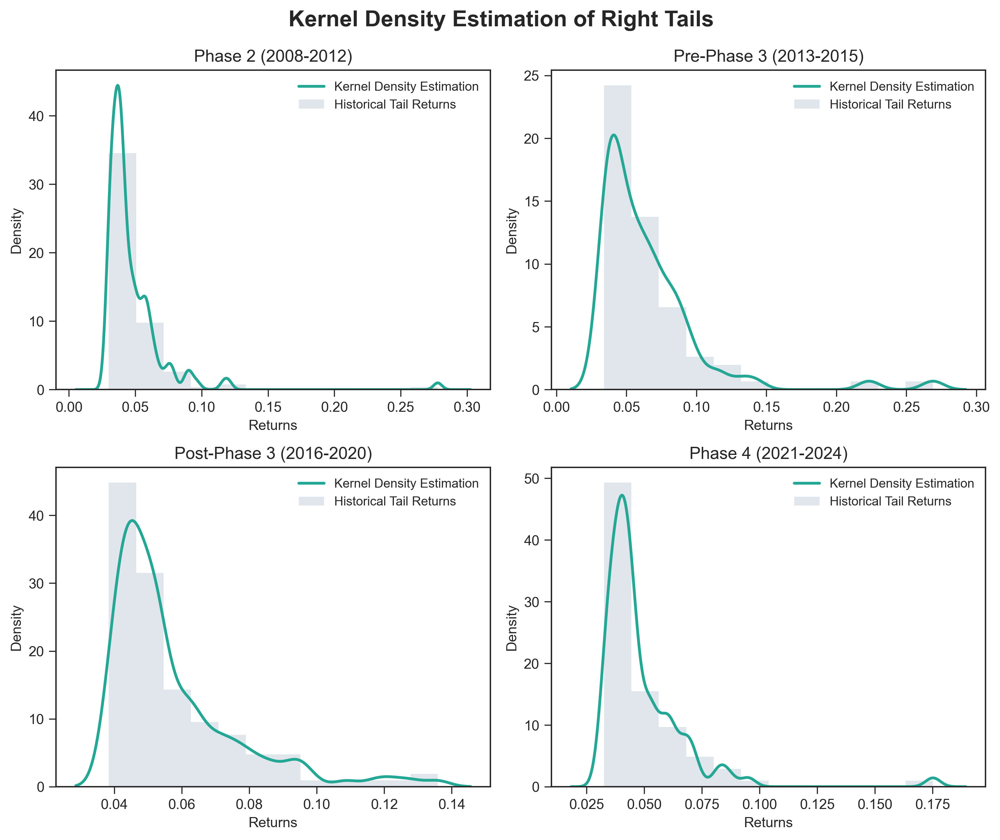
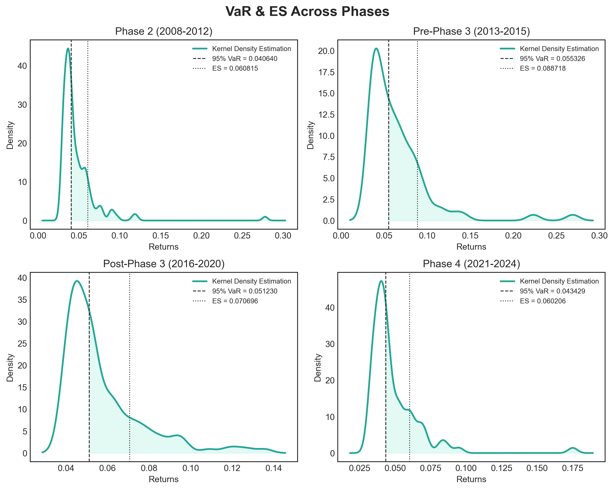
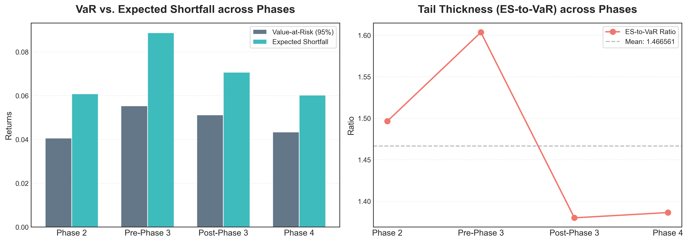

# Capturing Tail Risks in the Carbon Emission Allowance Returns Using Kernel Density Estimation

## Description
Traditional risk metrics often struggle with the "heavy tails" of carbon price swings. This project moves beyond standard Gaussian assumptions by applying Kernel Density Estimation (KDE) to Value-at-Risk (VaR) modelling. By analysing different market phases, this tool offers deeper insights into the extreme price risks of European Union Allowances (EUA), helping carbon-exposed industries better prepare for market volatility.

## Key Features
-	**Non-parametric Risk Modelling**: Using KDE to relax distributional assumptions, allowing for a more precise capture of heavy-tailed distributions and extreme market shocks.
-	**Phase-specific Analysis**: Evaluating risk evolution across EU ETS regulatory phases (Phase 2 to Phase 4) to identify how policy shifts and market maturity impact price volatility.
-	**Advanced Risk Metrics**: Quantifying risk through 95% VaR, Expected Shortfall (ES), and ES-to-VaR ratios, providing deeper insights into the severity of losses beyond the confidence threshold. 

## Data Setup 
### Data Overview
The analysis utilised historical EUA daily price data, characterised by the following:
-	Source: Bloomberg Terminal (EU ETS Transactions).
-	Period: January 2008 – May 2024.
-	Currency: Euro (€).

### Policy-Driven Segmentation
Since the EUA prices are heavily influenced by regulatory shifts rather than stochastic process, the data was segmented based on the stages of the EU ETS:
-	Phase 1 (2005 - 2007)
-	Phase 2 (2008 - 2012)
-	Phase 3 (2013 - 2020)
-	Phase 4 (2021 - Present)

>[!Important]
>-	Price data from Phase 1 (2005 - 2007) was excluded from the analysis due to nascent market demand and low transaction volumes, which do not reflect current market liquidity.
>-	Phase 3 (2013 - 2020) was further divided into Pre-2016 and Post-2016 subphases to account for the introduction of the Market Stability Reserve (MSR) proposal.

### Data Transformation
Raw daily prices were converted into simple returns to standardise market volatility. In this analysis, positive returns (right-tail risk) were considered as the primary risk factor, reflecting the financial strain that surging EUA prices impose on carbon-intensive industries.

### Privacy Disclaimer 
>[!warning]
>To comply with Bloomberg’s data licensing and privacy constraints, the raw dataset is not included in this repository. All code and outputs are provided for methodological demonstration purposes only.

## Methodology
### KDE Parameter 
| Parameters | Statistical Rationale |
| :--- | :--- |
| Gaussian Kernel | $K(u)=\frac{1}{\sqrt{2\pi}}\exp(-\frac{u^2}{2})$ |
| Sheater-Jones Plug-in Method| Find the optimal bandwidth that minimises AMISE. |

### Risk Metrics Calculation
The top 10% of returns were first isolated to reduce the influence of the central part of the distribution on the estimation results.
| Risk Metric | Technical Implementation |
| :--- | :--- |
| VaR | Derive the median of the extreme upper decile (top 10%) using KDE-derived densities.|
| ES | Calculate the average magnitude of extreme returns beyond VaR.| 

### Backtesting
The Kupiec test is a backtesting method specifically designed for VaR models. It examines whether the number of observed EUA returns exceeding the VaR is consistent with the number predicted by the model.

# Visualisations & Results
<figure>
  
  <figcaption align="center"><b>Figure 1:</b> Kernel Density Estimation with Original Returns.</figcaption>
</figure>  

 <figure>
  
  <figcaption align="center"><b>Figure 2:</b> 95% Value-at-Risk and Expected Shortfall.</figcaption>
</figure>

 <figure>
  
  <figcaption align="center"><b>Figure 3:</b> Trends of Risk Metrics over Time.</figcaption>
</figure>

## 🧪 Kupiec's Test Results
The following table summarises the reliability of the 95% VaR model across different phases:

| Phase | $N$ | $x$ | $\hat{p}$ | $LR$ | p-value | Pass Test |
| :--- | :---: | :---: | :---: | :---:| :---: | :---: |
| **Phase 2** | 1285 | 60 | 0.0467 | 0.3023 | 0.5824 | **Yes** |
| **Pre-Phase 3** | 774 | 39 | 0.0504 | 0.0024 | 0.9606 | **Yes** |
| **Post-Phase 3** | 1287 | 63 | 0.0490 | 0.0300 | 0.8625 | **Yes** |
| **Phase 4** | 869 | 42 | 0.0483 | 0.0515 | 0.8205 | **Yes** |

> *Note: All phases pass the Kupiec Test at a 5% significance level (p-value > 0.05).*

## 📉 Tail Risk Summary
The table below summarizes the extreme risk metrics derived from our KDE-based model:
| Phase | VaR | ES | ES-to-VaR |
| :--- | :---: | :---: | :---: |
| **Phase 2** | 0.0406 | 0.0608 | 1.4964 |
| **Pre-Phase 3** | 0.0553 | 0.0887 | 1.6036 |
| **Post-Phase 3** | 0.0512 | 0.0707 | 1.3800 |
| **Phase 4** | 0.0434 | 0.0602 | 1.3863 |
> **Key Insight**: The tail risk spiked significantly during **Pre-Phase 3**, with the ES-to-VaR ratio reaching **1.60**, indicating a much thicker right tail compared to other periods.
